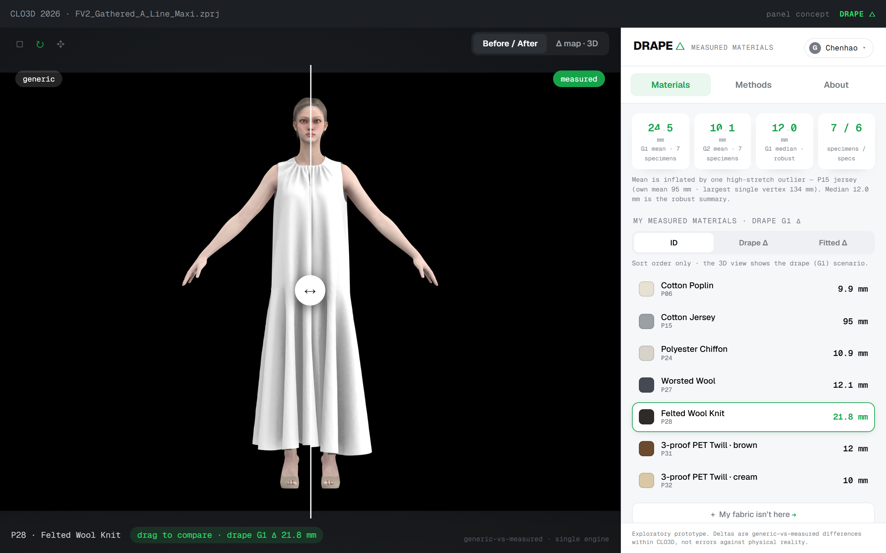
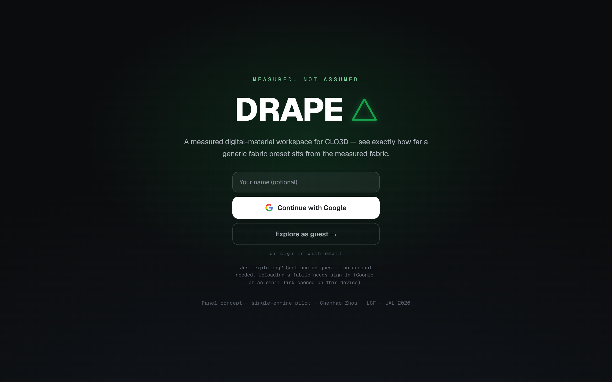
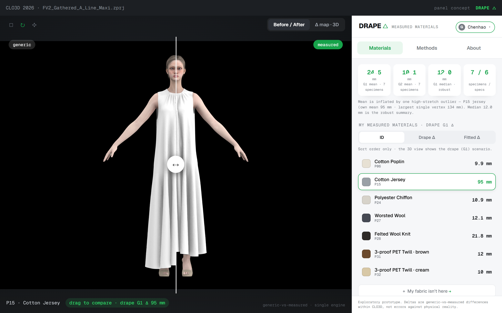
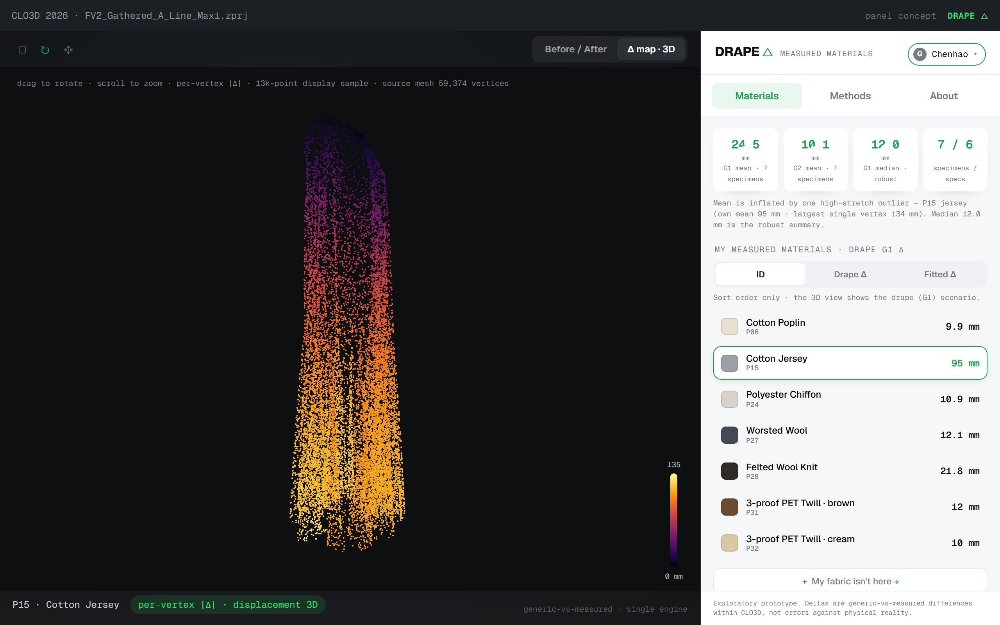
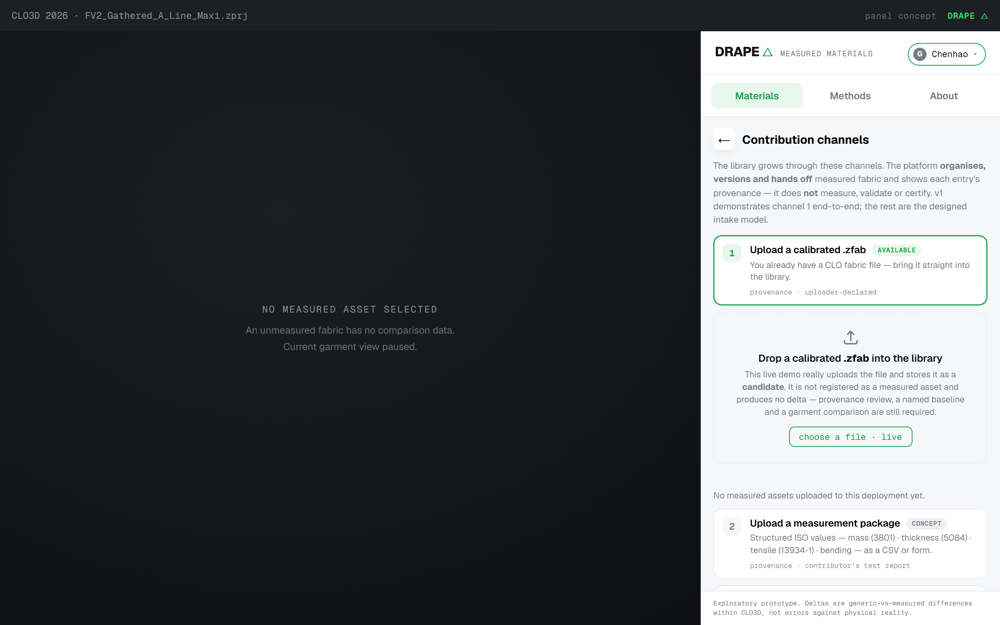

# DRAPE △ DELTA

   

**A measured digital-material library for CLO3D** — see exactly how far a generic fabric preset sits from the *real, physically-measured* fabric, as a generic-vs-measured before/after on the garment.

🔗 **Live demo → [drape-delta.netlify.app](https://drape-delta.netlify.app)**

---

## What it is

Digital fabric in 3D garment software usually starts from a *generic preset* — an assumption about how the cloth behaves. DRAPE △ takes seven fabrics that were **physically measured to ISO standards**, calibrated into CLO3D, and shows the gap between the generic preset and the measured fabric on the same garment — as a draggable before/after, a per-vertex displacement map, and property-by-property deltas.

It is built as a **contributor-populated library**: the seven measured fabrics are the seed, and anyone can browse them or contribute their own already-measured fabric. The platform *organises, versions and hands fabric back to CLO3D, and shows each entry's provenance* — it does **not** measure, validate or certify the data.

Two self-contained builds ship here: **`index.html`** (the CLO3D side-panel concept, desktop) and **`mobile.html`** (a phone companion at `/mobile`). Each is a single file with fonts, data, renders and a WebGL displacement point-cloud embedded — it runs offline.

## Screenshots

|  |  |
|---|---|
|  |  |
| **Guest-first sign-in** — browse with no account | **Before / after** — drag to compare generic vs measured |
|  |  |
| **Per-vertex displacement** — real mesh, 0–135 mm | **Contribution channels** — how the library grows |

## Features

- **Browse as a guest** — the whole library, before/after slider, 3D displacement, property isolation, all with no account.
- **Sign in to contribute** — Google one-click, or an email sign-in link ([Supabase](https://supabase.com) auth). Guests read; accounts write.
- **Real uploads** — a signed-in contributor can drop a calibrated `.zfab`; it is stored server-side ([Netlify Functions](https://docs.netlify.com/functions/overview/) + [Blobs](https://docs.netlify.com/blobs/overview/)) as a **candidate pending review**, tagged with the contributor's account.
- **Moderation** — you can delete your own uploads; a configured admin can remove any upload.
- **Evidence, not assertion** — WebGL per-vertex displacement cloud, draggable before/after, property-difference bars, and named provenance for every fabric.

## What this is — and is not

This is an **exploratory, single-engine pilot**, not a product or a validated measurement tool. It is the practice output of an MA research project, so the caveats are load-bearing:

- Every value is a **generic-vs-measured difference computed *within* CLO3D — not an error against physical reality.**
- One solver (CLO3D 2026.0.374, PD 10), **7 measured specimens**, no physical ground-truth validation; cantilever bending is **non-standard** and stretch is a **proxy index**.
- Generic preset thickness is a constant **0.50 mm placeholder** across presets, so part of every thickness delta reflects that default, not a class-specific value.
- The library **hosts and organises** contributed files and shows their provenance — it does **not** measure fabric, derive properties from a photo, or certify a contributor's data. An upload is a *candidate*; a named baseline + a garment comparison are still required (offline, in CLO3D) before any delta.

**Headline numbers** (verified against the project's before/after log): G1 drape mean delta **24.5 mm** — median **12.0 mm** (robust; the mean is inflated by one high-stretch outlier, P15 jersey, whose own mean is 95 mm and largest single vertex 134 mm); G2 fitted mean **10.1 mm**.

## How it's built

- **Front end** — one self-contained HTML file per build; inline WebGL (no Three.js) for the displacement point-cloud; base64-embedded Geist fonts, renders and data.
- **Storage** — Netlify Functions + Netlify Blobs for real upload / list / download / delete.
- **Accounts** — Supabase auth (Google + email), validated server-side; gracefully degrades to open mode when unconfigured. Setup guide: **[README_AUTH.md](./README_AUTH.md)**.
- **Hosting** — static site + serverless on Netlify. Deploy guide: **[README_DEPLOY.md](./README_DEPLOY.md)** (connect the repo; `netlify.toml` + `npm install` handle the rest).

## Author

**Chenhao Zhou** · MA Innovative Fashion Production · London College of Fashion, UAL · 2026
Licensed under the [MIT License](./LICENSE).
